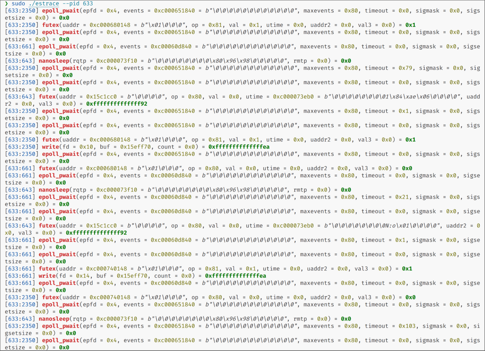

# eStrace

eStrace(eBPF syscall trace) is a tool that traces system calls using eBPF. Compared to strace, it is more flexible and harder to detect. It currently supports two architectures: x86_64 and aarch64. With eStrace, you can conveniently debug and analyze your Linux/Android applications.

## Usage

```bash
sudo ./estrace --help
Usage: estrace [OPTIONS]

Options:
  -p, --pid <PID>
          Target pid

  -t, --tid <TID>
          Target tid

  -u, --uid <UID>
          Target uid

  -f, --filter <FILTER>
          Trace only the specified set of system calls.  syscall_set is defined as [!]value[,value], and value can be one of the following:
          
          syscall      Trace specific syscall, specified by its name (see syscalls(2) for a reference, but also see NOTES).
          
          all          Trace all system calls.
          
          /regex       Trace only those system calls that match the regex.
          
          %file        Trace all system calls which take a file name as an argument.  You can think of this as an abbreviation for -e trace=open,stat,hmod,unlink,...  which is useful to seeing what files  the  process  is  referencing.  Furthermore, using the abbreviation will ensure that you don't accidentally forget to include a call like lstat(2) in the list.  Betchya woulda forgot that one.  The syntax without a preceding percent
          
          %process     Trace system calls associated with process lifecycle (creation, exec, termination).
          
          %net         Trace all the network related system calls.  The syntax without a preceding percent
          
          %signal      Trace all signal related system calls.  The syntax without a preceding percent
          
          %ipc         Trace all IPC related system calls.  The syntax without a preceding percent
          
          %desc        Trace all file descriptor related system calls.  The syntax without a preceding percent
          
          %memory      Trace all memory mapping related system calls.  The syntax without a preceding percent
          
          %creds       Trace system calls that read or modify user and group identifiers or capability sets.
          
          %stat        Trace stat syscall variants.
          
          %lstat       Trace lstat syscall variants.
          
          %fstat       Trace fstat, fstatat, and statx syscall variants.
          
          %%stat       Trace syscalls used for requesting file status (stat, lstat, fstat, fstatat, statx, and their variants).
          
          %statfs      Trace statfs, statfs64, statvfs, osf_statfs, and osf_statfs64 system calls.  The same effect can be achieved with -e trace=/^(.*_)?statv?fs regular expression.
          
          %fstatfs     Trace fstatfs, fstatfs64, fstatvfs, osf_fstatfs, and osf_fstatfs64 system calls.  The same effect can be achieved with -e trace=/fstatv?fs regular expression.
          
          %%statfs     Trace syscalls related to file system statistics (statfs-like, fstatfs-like, and ustat).  The same effect can be achieved with -e trace=/statv?fs|fsstat|ustat regular  expression.
          
          %clock       Trace system calls that read or modify system clocks.
          
          %pure        Trace  syscalls  that always succeed and have no arguments.  Currently, this list includes arc_gettls(2), getdtablesize(2), getegid(2), getegid32(2), geteuid(2), geteuid32(2), getgid(2), getgid32(2), getpagesize(2), getpgrp(2), getpid(2), getppid(2), get_thread_area(2) (on architectures other than x86), gettid(2), get_tls(2), getuid(2), getuid32(2), getxgid(2), getxpid(2), getxuid(2), kern_features(2), and metag_get_tls(2) syscalls.
          
          %seccomp_default Trace seccomp default actions.

  -h, --help
          Print help (see a summary with '-h')

```


## Building

### Setup

```bash
# check lld
ld.lld -v
rustup target add x84_64-unknown-linux-musl
cargo install bpf-linker
```
And for android:
```bash
rustup target add aarch64-unknown-linux-musl
```

### Build
```bash
cargo xtask build
cargo xtask build --arch aarch64-unknown-linux-musl

# release
cargo xtask build --release
cargo xtask build --arch aarch64-unknown-linux-musl --release
```

### Build and Run
```bash
cargo xtask run -- <args>
```

## ToDo

- Parse the structure of parameters.
- Support for additional architectures.
